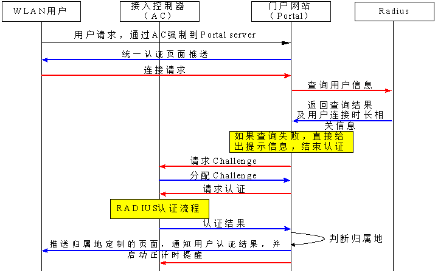
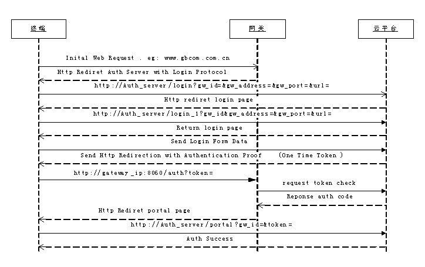

= Portal2GBC 需求方案
GB
:toc:
:toclevels: 4
:toc-position: left
:source-highlighter: pygments
:icons: font
:sectnums:

== 需求规格
=== 原始需求
----
From: 李贤平
Date: Tuesday, October 20, 2015 at 12:28 PM
To: 郑炳华, 潘妍艳, 段雄文, 马俊, 方政
Cc: 黄胜华
Subject: 广东移动某地市WIFI改造方案，，，

我们一个客户中标了该方案。
1，存量的CMCC网络，当前是通过BRAS连接省公司的portal来进行认证，需要调整为BRAS通过portal 2.0协议来接入到我们云平台来进行认证。
2，增量客户，使用我们全套的商业wifi功能。
3，以实现各个客户的portal模板的个性化。

该项目具有一定的可推广性。

云平台如何实现portal2.0，来对接BRAS。请各位考虑一下，以下思路供参考：
1，云平台实现虚拟热点的概念
2，做一个热点模拟器，来完成云平台和portal2.0之间的适配和对接
----
== 文档说明
适配云平台portal 2.0功能

=== 修改记录
[width="40%"]
|====================
| 文档版本|修订时间|修订人|修订内容
| 1.0     | 2015-11-08|方政|
|====================
=== 编写目的
运营商设备支持的标准portal 2.0认证方式，是目前云平台所不支持。考虑到云平台固有的认证方式，修改成本较大，所以，产生此模块来适配云平台。

== 需求分析
=== 业务需求
云营商portal认证需求

== portal认证
=== portal标准流程

=== 网关portal流程

=== 本方案流程描述
[plantuml, portal_convert, png]
....
终端 -> Bas: 开始发起http请求
note right: 连接wifi
Bas --> 终端: 重定向至中间件
终端 -> 中间件: 第二次发起http请求
note right: http://中间件ip:8080?acname=&userip=&other=
中间件 --> 终端: 重定向至云平台
note left: 报文url转换为云平台格式
终端 -> 云平台: 第三次发起http请求
note right: http://云平台ip/login?\ngw_id=&gw_address=&gw_port=&url=&\nip=&mac=&apmac=&ssid=&version=
|||
云平台 --> 终端: 送出portal页面
终端 -> 云平台: 输入用户名、密码，提交表单
云平台 --> 终端: 重定向报文至中间件
note right: 增加参数<color:red>username、password(DES加密)</color>
终端 -> 中间件: get请求发起portal认证
note right: http://中间件ip:8060/auth?token=&\n<color:red>&username=&password=</color>
|||
中间件 --> Bas: portal认证开始
Bas -> 中间件: portal验证用户合法，ACK_AUTH成功
中间件 -> 云平台: request token check
云平台 --> 中间件: response auth code
中间件 -> Bas: 发送AFF_ACK报文告诉Bas认证通过
|||
中间件 --> 终端: Http重定向至云平台
终端 -> 云平台: 访问云平台
note right: 携带gw_id,token
云平台 --> 终端: 认证通过
....

* request token check: +
[source, http]
GET /cmps/admin.php/api/auth/?stage=login&ip=172.16.1.2&mac=48:74:6e:36:17:2d&token=93230d4f9111b12fd92543cf133618926dd9371e&incoming=0&outgoing=0&gw_id=wlanbas&version=1.0 HTTP/1.0\r\n
User-Agent: WiFiDog 1.0.0\r\n
Host: www.example-url.com\r\n
\r\n

NOTE: 废弃字段：incoming | outgoing | version

* response auth code: +
[source, http]
HTTP/1.1 200 OK\r\n
Date: Thu, 31 Jul 2014 11:10:40 GMT\r\n
Expires: Thu, 19 Nov 1981 08:52:00 GMT\r\n
Cache-Control: private\r\n
Pragma: no-cache\r\n
Content-Length: 33\r\n
Connection: close\r\n
Content-Type: text/html; charset=utf-8\r\n
\r\n
\r\n
\r\n
\r\n
?Auth: 1\n
0 0 0 0 200 8640

* 认证失败： 中间件将终端重定向到以下URL页面 +
http://auth_server/cmps/admin/php/api/gw_message.php?message=denied

== 中间件管理
=== 中间件与平台保活流程
[plantuml, ping_pong, png]
....
中间件 -> 云平台: ping
note right: http://云平台ip/ping/?\ngw_id=&sys_uptime=&sys_memfree=&sys_load=&wifidog_uptime=
云平台 -> 中间件: pong
note left: Http Response: pong\\n
....

流程介绍: +
网关设备每隔 60 秒主动发送ping保活

* ping request: +
[source, http]
GET /cmps/admin.php/api/ping/?gw_id=wlanbas&sys_uptime=1&sys_memfree=3271392&sys_load=0.01&wifidog_uptime=253&res_tpl_version=0&res_product_version=0&res_adver_version=0&userversion=0&totalusernum=0&model=virturl&mac=28:51:32:08:f5:2c&version=1.0 HTTP/1.0\r\n
User-Agent: WiFiDog 1.0.0\r\n
Host: www.example-url.com\r\n
\r\n

NOTE: 废弃字段: sys_uptime | sys_memfree | sysload | wifidog_uptime | res_tpl_version | res_adver_version | userversion | totalusernum | version

* pong response: +
[source, http]
HTTP/1.1 200 OK\r\n
Date: Fri, 06 Feb 2015 01:50:58 GMT\r\n
Expires: Thu, 19 Nov 1981 08:52:00 GMT\r\n
Cache-Control: private\r\n
Pragma: no-cache\r\n
Content-Length: 119\r\n
Connection: close\r\n
Content-Type: text/html; charset=utf-8\r\n
\r\n
\r\n
\r\n
\r\n
Pong\n
conf_ver=67\n
cmd_ver=0\n
client_num=1\n
client_list=1.1.1.1|aa:aa:aa:aa:aa:aa\n
res_tpl_version=10\n
res_product_version=10\n
res_adver_version=10\n
soft_ver=www.example-url.com/cmps/static/zip/ver/xx\n
reboot_delay_time=0

NOTE: 废弃字段: conf_ver | cmd_ver | res_tpl_version | res_product_version | res_adver_version | soft_ver | reboot_delay_time

=== [black]#平台下发配置流程#
无

=== [black]#网关下AP信息上报#
无

== 终端信息
=== [black]#请求平台在线终端列表#
无

=== [black]#终端信息上报#
无

=== 云平台强制下线
[plantuml, req_offline, png]
....
participant Bas
中间件 <-- 云平台: pong
note left: 获取用户ip、mac
中间件 --> Bas: 发起req_logout
Bas -> 中间件: 发起ack_logout
....

* 云平台点击下线，云平台发出的 pong response 触发中间件下线

=== 终端无流量下线或者超时下线
[plantuml, offline, png]
....
Bas -> 中间件: ntf_logout
中间件 -> 云平台: 下线请求
note right: http://auth_server/auth?stage=logout&\ngw_id=&client_num=&client_list=
云平台 --> 中间件: 回复成功/失败
note left: success:0/1
中间件 -> Bas: ack_logout
....

=== [black]#当前终端信息获取接口#
无

=== [black]#用户感知信息上报#
无

== 中间件结构
使用 C 语言，监听 tcp端口(8080, 8060, 80), udp端口(50100)，结构如下图：
[plantuml, structure, png]
....
start
:"读取配置文件portal.conf,获取重定向地址\n创建tcp 8080、8060、80 和udp 50100监听端口";
fork
:"tcp 8080 recv";
:"判断是否重定向";
fork again
:"tcp 8060 recv";
:"用户认证开始";
fork again
:"tcp 80 recv";
if() then (收到pong下线)
:"终端下线";
else(收到token responde)
:"token response处理";
endif
fork again
:"udp 50100 recv";
:"终端下线和认证流程";
fork again
:"定时发起ping";
fork end
....

=== 转换Bas发出的重定向报文
* 转换前报文格式: +
http://中间件ip:8080?acname=&userip=&other=
* 转换后报文格式： +
http://云平台ip/login?gw_id=&gw_address=&gw_port=&url=&ip=&mac=&apmac=&ssid=&version=

=== 用户get请求发起portal认证处理
* 提取username和用户密码: +
http://中间件ip:8060/auth?token=&username=&password=

* portal认证交互

=== token校验交互
* token校验
* 通知Bas认证通过（AFF_ACK）
* 认证完重定向至云平台，携带（token、gw_id）

=== 终端下线
* 收到pong，发起下线
* 收到ntf_logout，发起下线
